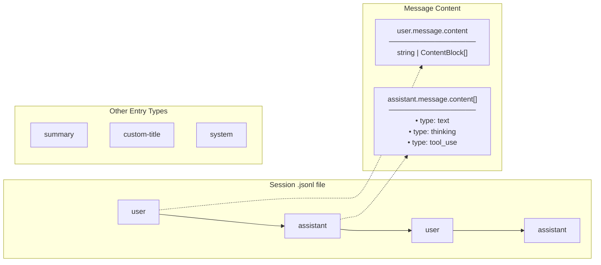

# cc-sessions

Agent-focused documentation. See README.md for user-facing docs.

## Build & Test

```bash
just build    # Build release binary
just test     # Run tests
just install  # Build and install to ~/.local/bin (macOS signing if applicable)
just lint     # Run clippy
```

## Architecture

### Code Organization

```
src/
  main.rs         # CLI, display, skim - general/timeless code
  claude_code.rs  # Session loading, JSONL parsing - format-specific
```

**Boundary principle:** If Claude Code changes its storage format, changes should be isolated to `claude_code.rs`. The `Session` struct in `main.rs` acts as an abstraction layer.

| Module | Responsibility | Changes when... |
|--------|---------------|-----------------|
| `main.rs` | CLI args, display formatting, skim integration | UI/UX requirements change |
| `claude_code.rs` | JSONL reading, metadata extraction, path discovery | Claude Code format changes |

### Session Storage Structure

```
~/.claude/projects/
  -Users-you-project-a/
    abc12345-1234-1234-1234-123456789abc.jsonl   # Session transcript (UUID filename)
    def45678-5678-5678-5678-567890123def.jsonl
  -Users-you-project-b/
    ghi78901-9012-9012-9012-901234567890.jsonl
```

Sessions are identified by UUID filenames. Non-UUID files (like `agent-*`) are filtered out.

### Session JSONL Message Types



## Implementation Details

### Session Discovery

All metadata is extracted directly from `.jsonl` files (no index dependency):

1. **Walk** `~/.claude/projects/*/` for `.jsonl` files
2. **Validate** filename is a UUID (8-4-4-4-12 hex format)
3. **Extract** metadata from file head + tail:
   - **HEAD** (first ~50 lines): `cwd` field → project path, first `user` message
   - **TAIL** (last ~16KB): `summary` type entry, `custom-title` entry
4. **Timestamps** from filesystem (created, modified)
5. **Filter out** empty sessions (no cwd, no user message, no summary)

Uses `rayon` for parallel processing across files.

### UUID Validation

Session filenames must match UUID format: `xxxxxxxx-xxxx-xxxx-xxxx-xxxxxxxxxxxx`

This filters out:
- `agent-*` files (subagent sessions spawned by Task tool)
- Other non-session files

### Metadata Extraction

| Field | Source | Location |
|-------|--------|----------|
| `project_path` | `cwd` field | File head |
| `first_message` | First `user` entry | File head |
| `forked_from` | `forkedFrom.sessionId` field | File head |
| `summary` | `summary` type entry | File tail (16KB) |
| `name` (customTitle) | `custom-title` entry | Grep entire file |
| `created` | Filesystem | `metadata.created()` |
| `modified` | Filesystem | `metadata.modified()` |

**Why grep for customTitle?** The `/rename` command can be invoked at any point in a session, so `custom-title` entries can appear anywhere in the file, not just the tail.

### Session Names (customTitle)
- Set via `/rename` command in Claude Code
- Stored as `{"type":"custom-title","customTitle":"...","sessionId":"..."}`
- Displayed with `★` prefix: `★ name - summary`
- Indicates user-marked important sessions

### Forked Sessions

Sessions can be forked via `/fork` command or `claude --fork-session`. A fork creates a **new session file** that copies the conversation history up to a point, allowing the user to explore an alternate path.

#### Fork Relationship Structure

```
Parent Session (511623e7-...)
  ├── Fork A (c33eb693-...)    # forkedFrom: 511623e7-...
  └── Fork B (cc0f0043-...)    # forkedFrom: 511623e7-...
```

Each entry in a forked session contains a `forkedFrom` field:

```json
{
  "type": "user",
  "message": {...},
  "sessionId": "cc0f0043-...",
  "forkedFrom": {
    "sessionId": "511623e7-...",      // Parent session ID
    "messageUuid": "23ede6bc-..."     // Corresponding message in parent
  }
}
```

#### Key Points

| Aspect | Behavior |
|--------|----------|
| Storage | Fork is a separate `.jsonl` file with full conversation copy |
| Relationship | `forkedFrom.sessionId` on entries links to parent |
| Index | `sessions-index.json` does NOT store fork relationships |
| customTitle | Claude Code auto-appends "(Fork)" to forked session titles |
| Detection | Must extract `forkedFrom` from JSONL file head (first ~50 lines) |

#### Extraction Strategy

1. Read first ~50 lines of each session file
2. Look for `forkedFrom.sessionId` field on any entry
3. Build parent→children map after loading all sessions
4. A session without `forkedFrom` is a "root" session
5. Multiple forks can share the same parent (siblings)

### Interactive Mode

Uses embedded [skim](https://github.com/lotabout/skim) crate (no external fzf dependency):

1. Build `SkimOptions` with preview command pointing to self
2. Send `SessionItem`s through crossbeam channel
3. Preview generates content directly (no subprocess)
4. On selection, spawns `zsh -c "cd <project> && claude -r <session-id>"`

#### Fork Navigation (Subtree Drill-down)

Interactive mode uses a **navigation stack** for exploring fork trees:

- **Root view**: Shows only root sessions (those without a parent in the session set)
- **`▶` indicator**: Session has child forks
- **`▷` indicator**: Focused parent (distinguishes from children with forks)
- **→ (right arrow)**: Drill into selected session, showing parent + direct children only
- **← (left arrow)**: Go back to previous view (pop from stack)
- **Esc**: Return to root view (clear entire stack)

```
Root View                    After → on e5e2d           After → on 398eb
─────────────────────        ─────────────────────      ─────────────────────
▶ e5e2d  (parent)            ▷ e5e2d  (focused)         ▷ 398eb  (focused)
  f1064  (no forks)          ▶ 398eb  (child w/forks)     5b88a  (direct child)
  ...                          c0ff2  (child)             c0ff2  (direct child)
```

Note: Each drill-down shows only **direct children**, not all descendants. To see grandchildren, drill into the child session.

#### Column Layout

Interactive mode displays a header with column legend:

```
  CRE  MOD  MSG SOURCE PROJECT      SUMMARY
```

| Column | Description |
|--------|-------------|
| CRE | Created timestamp (relative) |
| MOD | Modified timestamp (relative) |
| MSG | Turn count (user messages, excludes system content) |
| SOURCE | Session source (local, remote) |
| PROJECT | Project directory name |
| SUMMARY | AI-generated summary or custom title |

#### Turn Counting

The MSG column shows actual user turns, filtering out system content:
- Excludes `<command-...>` tags (hook output)
- Excludes `[...]` bracketed content (local tool output)
- Excludes `/...` commands (slash commands)

#### Debug Mode

`--debug` flag adds a 5-character session ID prefix column for debugging navigation.

## Dependencies

- **Build**: Rust 1.85+ (edition 2024)
- **Runtime**: None (skim is embedded, preview is self-contained)

### Key crates

| Crate | Purpose |
|-------|---------|
| `skim` | Embedded fuzzy finder (replaces fzf) |
| `rayon` | Parallel file processing |
| `grep-regex`, `grep-searcher` | Fast pattern matching for customTitle |
| `serde_json` | JSONL parsing |
| `clap` | CLI argument parsing |
