# cc-session

A fast CLI tool to list and resume Claude Code sessions across all projects.

## Build & Install

```bash
cargo build --release
cp target/release/cc-session ~/bin/cc-sessions
# macOS: ad-hoc sign to avoid Gatekeeper killing unsigned binaries
xattr -cr ~/bin/cc-sessions && codesign -s - ~/bin/cc-sessions
```

## Usage

```bash
cc-sessions              # List 15 most recent sessions
cc-sessions -c 30        # List 30 sessions
cc-sessions -i           # Interactive fzf picker with transcript preview
cc-sessions -f           # Fork a session (creates new session ID)
cc-sessions -i -f        # Interactive mode + fork
cc-sessions -p dotfiles  # Filter by project name (case-insensitive substring)
cc-sessions -p bike -i   # Filter + interactive mode
```

## Architecture

### Session Storage Structure


### sessions-index.json Format


### Session JSONL Message Types

```mermaid
flowchart LR
    subgraph "Session .jsonl file"
        direction TB
        U1[user] --> A1[assistant]
        A1 --> U2[user]
        U2 --> A2[assistant]
    end

    subgraph "Message Content"
        direction TB
        UM["user.message.content<br/>─────────────────<br/>string | ContentBlock[]"]
        AM["assistant.message.content[]<br/>─────────────────<br/>• type: text<br/>• type: thinking<br/>• type: tool_use"]
    end

    subgraph "Other Entry Types"
        SUM[summary]
        SYS[system]
        FHS[file-history-snapshot]
    end

    U1 -.-> UM
    A1 -.-> AM
```



### Session Discovery
- Reads `sessions-index.json` files from `~/.claude/projects/*/`
- Each index contains session metadata: id, projectPath, firstPrompt, created, modified
- Filters out sessions where the `.jsonl` file no longer exists
- Uses `rayon` for parallel processing of index files

### Data Source
Claude Code maintains `sessions-index.json` in each project directory with:
- `projectPath`: Actual filesystem path (e.g., `/Users/iantay/Documents/repos/bike-power`)
- `firstPrompt`: First user message (already extracted)
- `created`/`modified`: ISO 8601 timestamps

**Fields cc-sessions reads:** sessionId, fullPath, projectPath, firstPrompt, summary, created, modified

**Fields cc-sessions ignores:** customTitle, fileMtime, messageCount, gitBranch, isSidechain, version

Note: The index may contain stale entries for deleted sessions. We filter these by checking if `fullPath` exists.

### Interactive Mode
- Pipes session list to fzf with tab-delimited fields
- Preview runs `jaq` to extract conversation transcript from `.jsonl` files
- On selection, spawns `zsh -c "cd <project> && claude -r <session-id>"`

**Hybrid Search (ctrl-s / ctrl-n):**
- `ctrl-s`: Switch to **search mode** - full-text search across all session transcripts using ripgrep
- `ctrl-n`: Switch to **normal mode** - fuzzy filter by project name and summary
- In search mode, preview shows matching context with highlighting
- Search is live - results update as you type (~100-200ms latency)

## Dependencies

- **Runtime**: `fzf` and `jaq` (for interactive mode preview)
- **Build**: Rust 1.85+ (edition 2024), rayon for parallelism

## Output Format

List mode shows relative times and AI-generated summary:
```
CREAT  MOD    PROJECT      SUMMARY
──────────────────────────────────────────────────────────────────────────────────────────
1h     1h     dotfiles     Shell alias structure refactoring
2d     3h     bike-power   Bike Power App: Build 10, Landscape Layout
```

Interactive mode (`-i`):
- Fuzzy search matches project name, summary, and full transcript metadata
- Preview pane shows conversation transcript with 👤 user / 🤖 assistant prefixes
- Use `-f` flag to fork instead of resume (creates new session ID)
